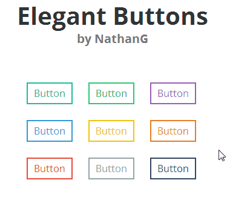

# Elegant Buttons
Elegant buttons is a set of... well, elegant buttons. At a little under 3KB, they are also _extremely_ lightweight and easy to use! Read on or check out the demo.



## How to use
Using Elegant Buttons is super simple, just include the class _elegant-button_ or _elegant-button-big_ in your element, then your color, and then you are ready to go!

### Colors
Thanks to [Flat UI Colors](http://flatuicolors.com/) for the colors used in this. They are listed in order of appearance on the demo and in the gif above.

- turqoise
- green
- purple
- blue
- yellow
- orange
- red
- grey
- dark

### Example Usage
Here is in example of a button.
```html
<a href="#" class="elegant-button green">Button</a>
```